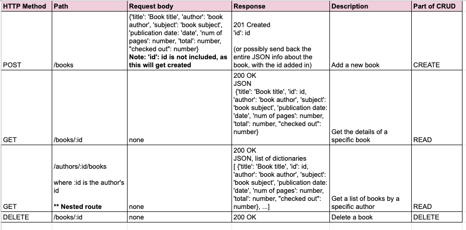
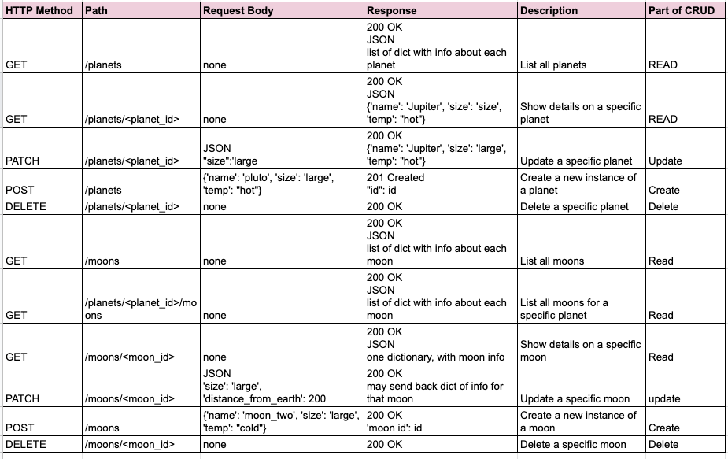

## Python request package:
[Documentation about using request package in python](https://docs.python-requests.org/en/master/)    

[quick start for request package](https://docs.python-requests.org/en/master/user/quickstart/)
- You must **pip install** request into your virtual environment:  
```
 $ python -m pip install requests
 ```  
- `import requests` at top of file
- `path = url`
- `key = access_token`
- `query_params = {key:value, key:value}`
- `response = request.get(path, params=query_params)`
- `response.json()` : turns code from json to python data structure
- **Tip**: use a breakpoint, placed at time of calling response, and step into funciton with debugger, to inspect the api's response.
  
---
# RESTful APIs

**REST** = representaional state transfer
- Design principal preferring reliable/predicable endpoints that focus on resources.  
- Uses HTTP (vs. SOAP or something else)
- Mainains **statelessness** of the server... will not track data about the user between requests
- returns a standard media type (JSON, HTML, etc)
- has a **uniform interface** and resource based paths (endpoints are based on resources)
  

**CRUD**: Create, Read, Update, Delete

---
Example requests/responses for an imaged app (focusing on connecting runners with each other):

1. **Requesting a runner that exists**  
HTTP Request: GET /runners/55, no request body  
HTTP Response: 200 OK  
Response body (JSON):  
{
    "name": "Emuna Smith",
    "id_num": 55,
    "pace-group": "group_3"
    "neighborhood": "White Center, Seattle, WA"
}
2. **Requesting an runner that does not exist**  
HTTP Request: GET /runners/200, no request body  
HTTP Response: 404 Not found, no response body

3. **Requesting a list of resources**  
HTTP request: GET /runners  
HTTP Response: 200 OK  
Response body:   
list of dictionaries containing all runners, see above example 1 for info included within dict [ {runner_1 details}, {runner_2 details}]

4. **Deleting a resource that exists**:  
HTTP request: DELETE /runners/55, no HTTP body  
HTTP response: 200 OK, no HHTP body

5. **Deleting a resource that does not exist**  
HTTP request: DELETE /runners/200, no request body  
HTTP response: 404 Not found, no response body

6. **Creating a new resource**  
HTTP request: POST /runners  
request body (JSON):  
{
    "name": "Edith Tims",
    "id_num": 55,
    "pace-group": "group_3"
    "neighborhood": "White Center, Seattle, WA"
}  

    HTTP response: 201 Created, no response body

---
## Class examples of API designs:
### Bookstore

### Planets
